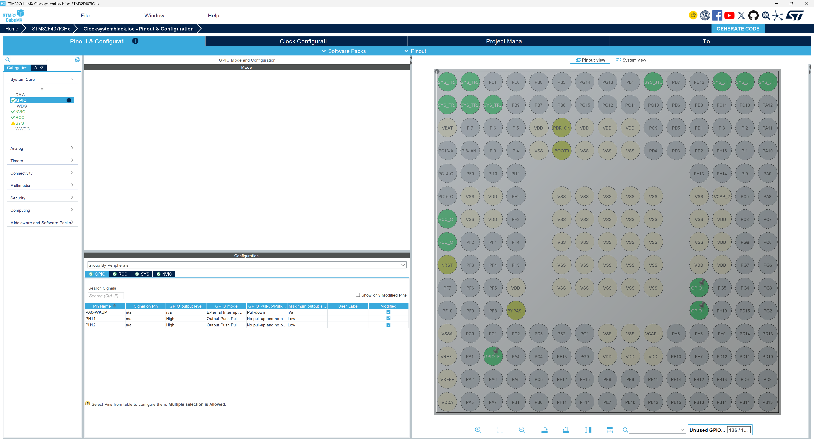
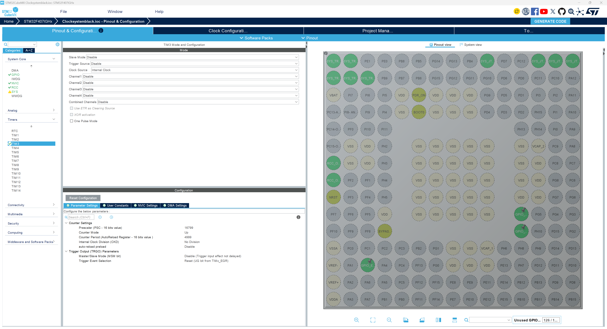
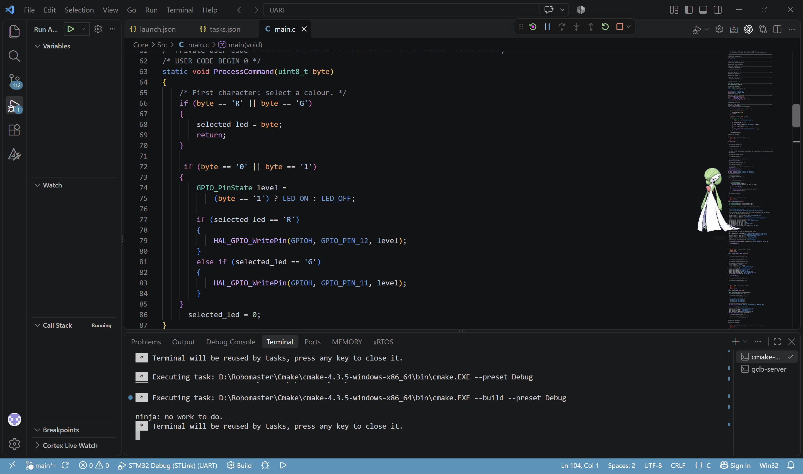
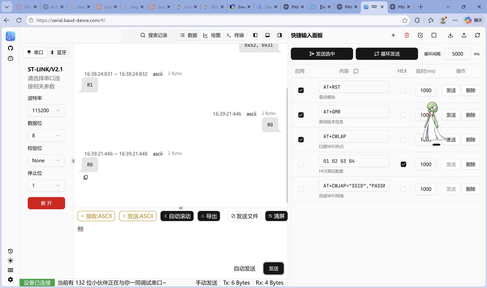

第一·二次作业：[让 LED 灯闪烁并完成红灯每秒闪烁，绿灯按下后反转]

实现过程：
第一次作业：使用STM32F407VGT板 在完成了基础配置， 并编写代码使小灯闪烁
第二次作业：使用STM32F407IGH板，重新配置，在主程序中根据更改红灯闪烁时间，
课上：正常完成红灯每秒闪烁，绿灯按下后反转
课下：让定时器中断控制红灯，红灯固定由 1 秒定时器控制；按键只控制绿灯翻转

1.启动定时器代码
```c
MX_TIM3_Init();

__HAL_TIM_CLEAR_FLAG(&htim3, TIM_FLAG_UPDATE);
HAL_TIM_Base_Start_IT(&htim3);
```

2.让红灯反转
```c
void HAL_TIM_PeriodElapsedCallback(TIM_HandleTypeDef *htim)
{
    if (htim->Instance == TIM3)
    {
        HAL_GPIO_TogglePin(GPIOH, GPIO_PIN_12);
    }
}
```

3.按键独立控制绿灯
```c
void HAL_GPIO_EXTI_Callback(uint16_t GPIO_Pin)
{
    if (GPIO_Pin == GPIO_PIN_0)
    {
        HAL_GPIO_TogglePin(GPIOH, GPIO_PIN_11);
    }
}
```

CubeMX 配置截图
第一二次作业截图



补充：
在 homework 文件夹的原有版本中包含 AI 辅助添加的按键消抖：
按键中断控制绿灯时，加入简单消抖。
按下按钮后，EXTI 检测上升沿，调用按键回调。50 毫秒内的重复触发会被忽略，减少机械接触抖动造成的连续翻转。中断内没有使用可能导致卡住的延时函数

第三次作业：[串口接收和回传，通过指令控制红绿灯]

实现过程：
使用STM32F407IGH板，板子上UART1接口实际对应USART6，使用huart6。
配置波特率115200，8位数据，无校验，1位停止位；TX和RX交叉连接，并共地。
红灯PH12、绿灯PH11配置为GPIO输出，打开USART6全局中断。
先使用轮询接收电脑发来的字符，回传相同内容，再根据R0、R1、G0、G1控制小灯。
第二步：把轮询接收改为中断接收，收到字符后先存起来，在主循环中回传并控制小灯。

工程位置：[two_works/03_uart/UART](two_works/03_uart/UART)
轮询版本保存在commit c78e03a，当前代码是中断接收版本。

1.启动串口中断接收

放在初始化之后、while循环之前，每次接收一个字节。

```c
if (HAL_UART_Receive_IT(&huart6, &rx_byte, 1) != HAL_OK)
{
    Error_Handler();
}
```

2.收到字符后重新开启接收

HAL收满一个字节后调用回调函数，把字符放进队列，再开启下一次接收。

```c
void HAL_UART_RxCpltCallback(UART_HandleTypeDef *huart)
{
    if (huart->Instance != USART6)
    {
        return;
    }

    QueuePush(rx_byte);
    if (HAL_UART_Receive_IT(huart, &rx_byte, 1) != HAL_OK)
    {
        rx_fault = 1;
    }
}
```

3.主循环回传并控制小灯

从队列取出一个字符，通过串口发回电脑，再交给ProcessCommand判断。
R选择红灯，G选择绿灯，后面的0表示关闭，1表示打开。

```c
uint8_t byte;

if (rx_fault)
{
    Error_Handler();
}

if (QueuePop(&byte))
{
    if (HAL_UART_Transmit(&huart6, &byte, 1, 100) != HAL_OK)
    {
        Error_Handler();
    }
    ProcessCommand(byte);
}
```

串口截图
以下保留之前的阶段截图，中断版本的测试截图待补充。




补充：
中断中只接收和保存字符，不在里面发送或延时；发送仍使用阻塞方式。
队列可以暂存255个字符，队列满或串口出错时会进入Error_Handler，目前没有自动恢复。
当前LED_ON为高电平，LED_OFF为低电平，实测如果亮灭相反就交换这两个定义。


